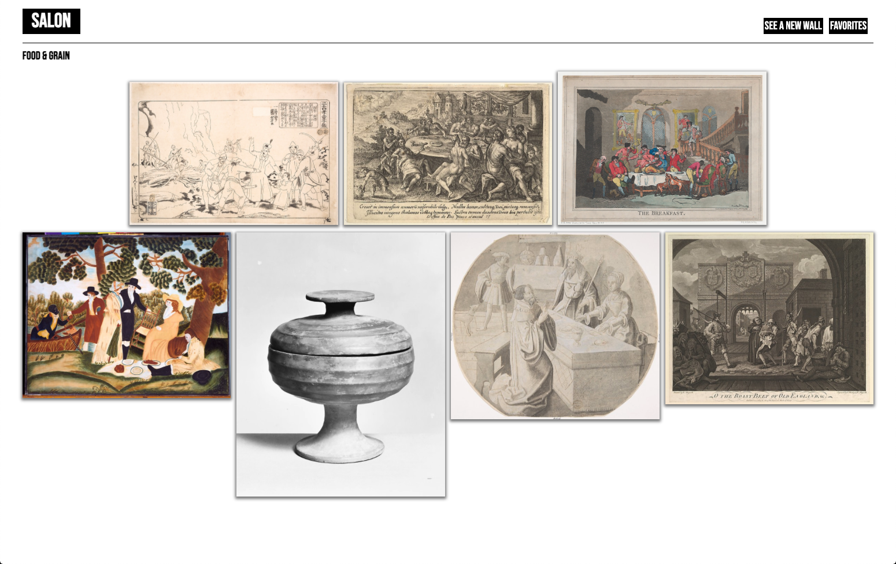
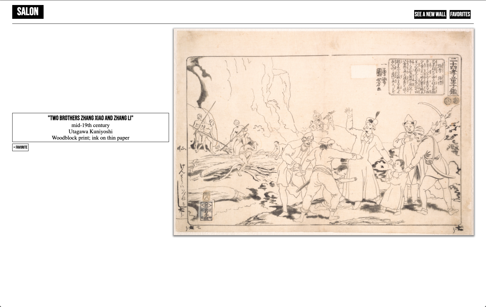
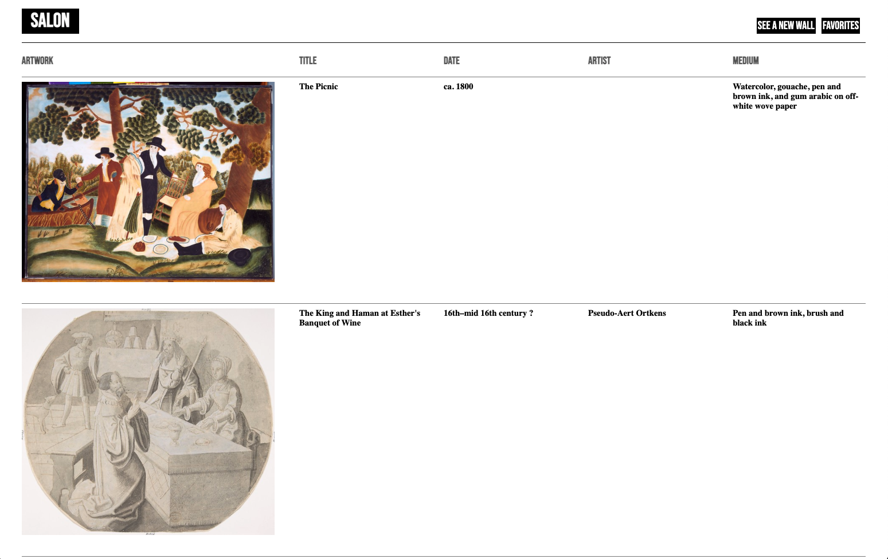
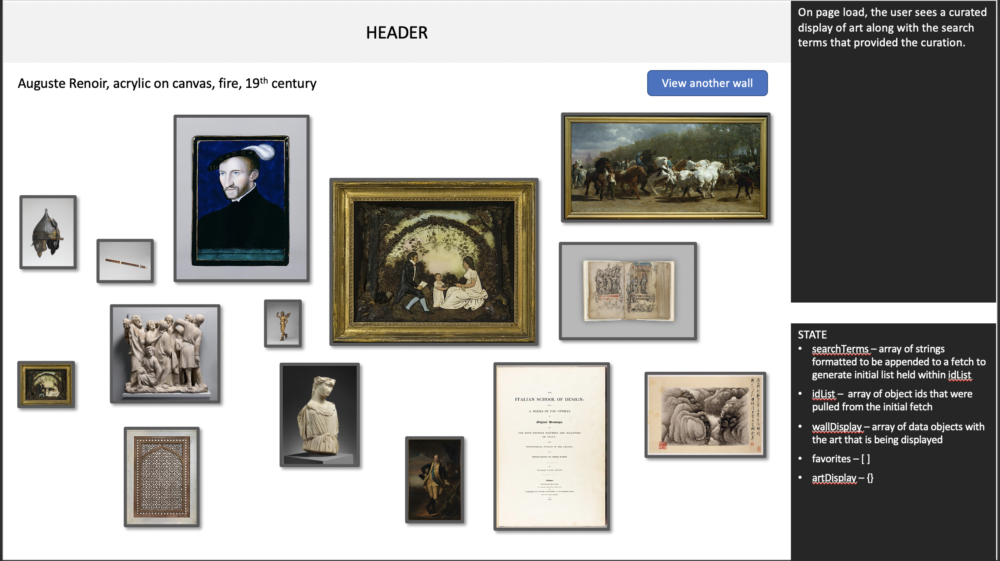
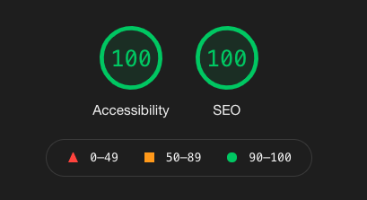

# Salon

## About the Project

In this project, our team was tasked with creating an app of our own design, using a technology that we had to teach ourselves. We chose to use React Context API for global state management to create Salon, an app which simulates the art museum experience.

The artwork was sourced from the Metropolitan Museum of Art Collection API.
https://metmuseum.github.io/

Project spec ->
https://frontend.turing.edu/projects/module-3/stretch.html

#### Final Product:
##### Salon Page:

##### Details Page:

##### Favorites Page:

## Project Goals
1. Learn React Context API through an app of our design.
2. Create multipage app using Router.
3. Make network requests to API endpoints to retrieve and manipulate data.
4. Use Object Oriented Programming (OOP) to drive the design of the application and the code.
5. Create a test suite using Cypress that thoroughly tests all the functional aspects of the application.
6. Ensure the app is following best accessibility practices.
7. Leverage SASS to DRY up CSS.
8. Make the app responsive so that content can be viewed on all devices.

## Installation
View the code ->
https://github.com/mattumland/Salon

## Technologies Used

- 

- 

- 

- 

- 

- 

- 

## Wireframes
Low fidelity wireframes allowed us to map out the user flow and create proof-of-concept images for our salon layouts. We tested all user stories with our wireframes/prototypes to ensure that our designs catered to the needs of our users.

## Functionality

#### Psuedo-curated display
While many museums post their collections online, we wanted to breakdown the barrier of searching through a large database of art by generating 'psuedo-curated' displays centered around randomly selected themes. These displays are presented in a layout reminiscent of a classic salon style. Users can generate a new wall display with the click of a single button.

#### Detail view
Clicking on an artwork reveals a high quality image of the piece along relevant details. From this view, users can add the art to their favorites list.

#### Favorites View
The favorites view allows users to see all of their saved artwork. Each image also functions as a link to the corresponding detail view.

#### Error Handling
Error handling was considered when building the website. A loading screen will appear when any content is still rendering. Error messages are displayed when they are returned from the API and in other specific edge cases.

#### Responsiveness

#### Accessibility
Salon received a 100% from Lighthouse on Accessibility. Users can tab throughout the full application, making it accessible for those using keyboards to navigate through.

## Contact the Contributers

Matt Umland
LinkedIn: https://www.linkedin.com/in/matt-umland-he-him-4264455b/
LinkedIn: https://github.com/mattumland

Reggie Thompson
LinkedIn: https://www.linkedin.com/in/reggie-thompson-136979
LinkedIn: https://github.com/rdtho2525

Charles Morris
LinkedIn: https://www.linkedin.com/in/chuck-morris-56819918/
LinkedIn: https://github.com/percworld
